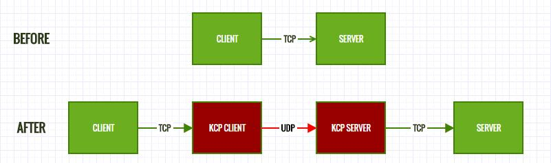
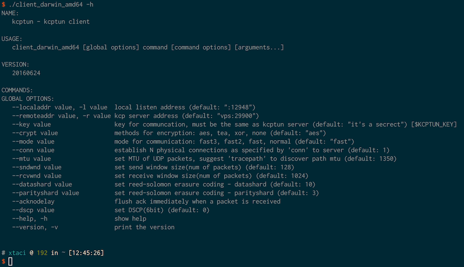
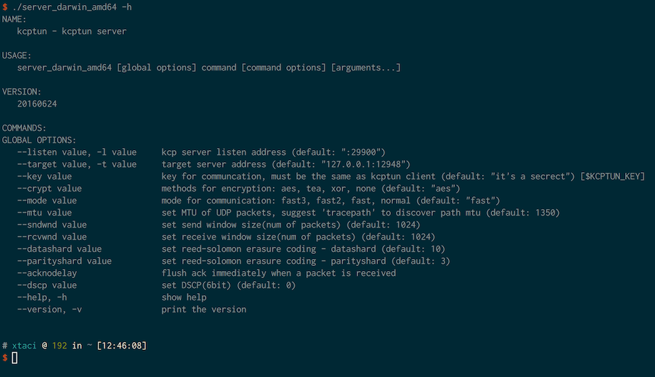

# kcptun(KT)
TCP流转换为KCP+UDP流，:snowflake:[下载地址](https://github.com/xtaci/kcptun/releases/latest):snowflake:工作示意图：  



***kcptun是[kcp](https://github.com/skywind3000/kcp)协议的一个简单应用，可以用于任意tcp网络程序的传输承载，以提高网络流畅度，降低掉线情况。***   

### 使用の方法:lollipop:



### 适用范围限定:lollipop:   
1. 实时网络游戏的数据传输        
2. 跨运营商的流量传输               
3. 其他高丢包通信链路的TCP承载      

### 性能对比:lollipop:
```
root@vultr:~# iperf -s
------------------------------------------------------------
Server listening on TCP port 5001
TCP window size: 4.00 MByte (default)
------------------------------------------------------------
[  4] local 172.7.7.1 port 5001 connected with 172.7.7.2 port 55453
[ ID] Interval       Transfer     Bandwidth
[  4]  0.0-18.0 sec  5.50 MBytes  2.56 Mbits/sec     <-- connection via kcptun
[  5] local 45.32.xxx.xxx port 5001 connected with 218.88.xxx.xxx port 17220
[  5]  0.0-17.9 sec  2.12 MBytes   997 Kbits/sec     <-- direct connnection via tcp
```

### 免责申明:warning:
用户以各种方式使用本软件（包括但不限于修改使用、直接使用、通过第三方使用）的过程中，不得以任何方式利用本软件直接或间接从事违反中国法律、以及社会公德的行为。软件的使用者需对自身行为负责，因使用软件引发的一切纠纷，由使用者承担全部法律及连带责任。作者不承担任何法律及连带责任。       

对免责声明的解释、修改及更新权均属于作者本人所有。
