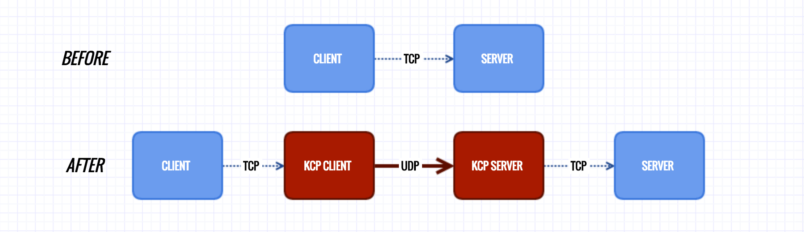

# *kcptun*
TCP流转换为KCP+UDP流，:zap:***[下载地址](https://github.com/xtaci/kcptun/releases/latest)***:zap:工作示意图：  



***kcptun是[kcp](https://github.com/xtaci/kcp-go)协议的一个简单应用，可以用于任意tcp网络程序的传输承载，以提高网络流畅度。***   
_采用极简设计，客户端＋服务器源码总共400行，方便用户自己扩展_ 。        

### *使用の方法* :lollipop:


### *适用范围限定* :lollipop:   
1. 实时网络游戏的数据传输        
2. 跨运营商的流量传输               
3. 其他高丢包通信链路的TCP承载      

### *推荐参数* :lollipop: 
```
适用大部分ADSL接入（非对称上下行）的参数（实验环境电信100M ADSL）
SERVER:   -mtu 1400 -sndwnd 2048 -rcvwnd 2048 -mode fast2
CLIENT:   -mtu 1400 -sndwnd 256 -rcvwnd 2048 -mode fast2
其它带宽请按比例降低窗口，比如50M ADSL，把CLIENT的 -sndwnd -rcvwnd减掉一半,SERVER不变
```
*巭孬嫑乱动*        

### *DSCP* :lollipop: 
DSCP差分服务代码点（Differentiated Services Code Point），IETF于1998年12月发布了Diff-Serv（Differentiated Service）的QoS分类标准。它在每个数据包IP头部的服务类别TOS标识字节中，利用已使用的6比特和未使用的2比特，通过编码值来区分优先级。     
常用DSCP值可以参考[Wikipedia DSCP](https://en.wikipedia.org/wiki/Differentiated_services#Commonly_used_DSCP_values)，至于有没有用，完全取决于数据包经过的设备。

### *内置模式* :lollipop: 
响应速度:     
*fast3 >* ***[fast2]*** *> fast > normal > default*        
有效载荷比:     
*default > normal > fast >* ***[fast2]*** *> fast3*       
中间mode参数比较均衡，总之就是越快越浪费带宽，推荐模式 ***fast2***         
更高级的 ***手动档*** 需要理解KCP协议，并通过 ***隐藏参数*** 调整，例如:
```
 -mode manual -nodelay 1 -resend 2 -nc 1 -interval 20
```

### *SNMP* :lollipop:
```go
// Snmp defines network statistics indicator
type Snmp struct {
    BytesSent       uint64 // payload bytes sent
    BytesReceived   uint64
    MaxConn         uint64
    ActiveOpens     uint64
    PassiveOpens    uint64
    CurrEstab       uint64
    InErrs          uint64
    InCsumErrors    uint64 // checksum errors
    InSegs          uint64
    OutSegs         uint64
    OutBytes        uint64 // udp bytes sent
    RetransSegs     uint64
    FastRetransSegs uint64
    LostSegs        uint64
    RepeatSegs      uint64
    FECRecovered    uint64
    FECErrs         uint64
    FECSegs         uint64 // fec segments received
}
```

使用```kill -SIGUSR1 pid``` 可以在控制台打印出SNMP信息，通常用于精细调整***当前链路的有效载荷比***。        
观察```RetransSegs,FastRetransSegs,LostSegs,OutSegs```这几者的数值比例，用于参考调整```-mode manual,fec```的参数。        

### *性能对比* :lollipop:
```
root@vultr:~# iperf -s
------------------------------------------------------------
Server listening on TCP port 5001
TCP window size: 4.00 MByte (default)
------------------------------------------------------------
[  4] local 172.7.7.1 port 5001 connected with 172.7.7.2 port 55453
[ ID] Interval       Transfer     Bandwidth
[  4]  0.0-18.0 sec  5.50 MBytes  2.56 Mbits/sec     <-- connection via kcptun
[  5] local 45.32.xxx.xxx port 5001 connected with 218.88.xxx.xxx port 17220
[  5]  0.0-17.9 sec  2.12 MBytes   997 Kbits/sec     <-- direct connnection via tcp
```

### *免责申明* :warning:
用户以各种方式使用本软件（包括但不限于修改使用、直接使用、通过第三方使用）的过程中，不得以任何方式利用本软件直接或间接从事违反中国法律、以及社会公德的行为。软件的使用者需对自身行为负责，因使用软件引发的一切纠纷，由使用者承担全部法律及连带责任。作者不承担任何法律及连带责任。       

对免责声明的解释、修改及更新权均属于作者本人所有。
